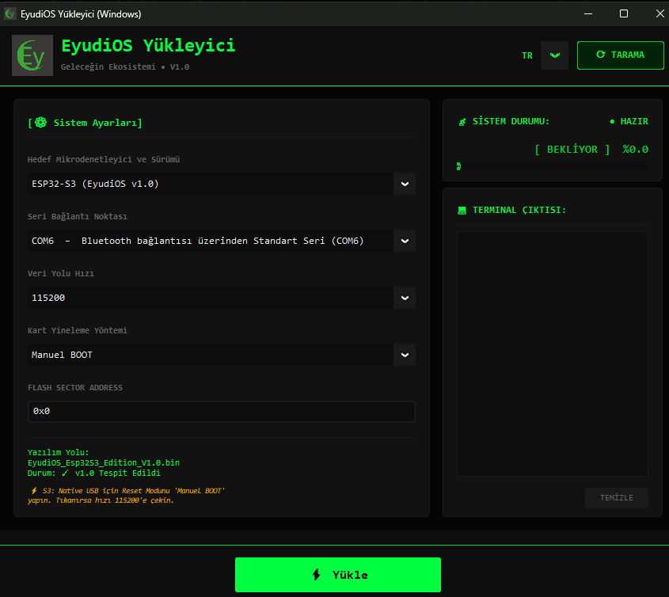

<div align="right">
  <a href="README.tr.md">
    
  </a>
  
</div>

---

# 🚀 Eyudio Flasher

<p align="center">
  <b>Modern • Fast • User-Friendly Firmware Flash Tool</b>
</p>

---

## 📌 About

**Eyudio Flasher** is a modern flashing tool developed to simplify firmware uploading processes for development boards such as Arduino, ESP32, ESP32-S3, and Arduino Leonardo/Uno.

By gathering complex command-line operations under a single interface, it provides users with a simpler and faster experience.

Supported tools:

- 🔹 `avrdude` → AVR-based boards
- 🔹 `esptool` → ESP-based boards

---

# ✨ Features

✅ Modern CustomTkinter interface  
✅ Automatic COM port detection  
✅ Arduino HEX firmware flashing  
✅ ESP32 / ESP32-S3 BIN firmware flashing  
✅ Easy firmware selection  
✅ Real-time process outputs  
✅ User-friendly error messages  
✅ Portable operation support  

---

# 📦 Installation

## Requirements

If you are not using the Windows operating system, your system must have:

- Python 3.x
- Required Python libraries

installed.

To install the libraries automatically:

```bash
pip install -r requirements.txt
```

This command is sufficient. 🚀

---

# ▶️ Running

After downloading the project:

```bash
python flasher.py
```

you can start it with this command.

---

# 🪟 Windows Users

For users who do not want to deal with Python installation:

> 💻 Windows `.exe` version

can be used.

Download → Run → Flash firmware 🚀

---

# 📁 Supported Firmware Types

| Platform | Format |
|---|---|
| Arduino | `.hex` |
| ESP32 | `.bin` |
| ESP32-S3 | `.bin` |

---

# 🛠 Technologies Used

- 🐍 Python
- 🎨 CustomTkinter
- 🔌 PySerial
- ⚙️ AVRDUDE
- ⚡ ESPTOOL

---

# 📸 Screenshot
<p align="center">
  
</p>
---

# ⚠️ Warnings

During firmware flashing:

- Do not disconnect the USB connection.
- Make sure you select the correct COM port.
- Use the appropriate firmware for the correct device.

Flashing the wrong firmware may cause your device to not work.

---

# ❤️ Developer

**Eyudio Team**

Developed for open source and hardware projects of the future. 🚀

---

## ⭐ Support Us

If you like the project:

⭐ Giving a star  
🔁 Sharing  
💡 Contributing  

don't forget!

---

# 🎉 Enjoy using it!

**Welcome to the firmware world with Eyudio Flasher. 🚀**
